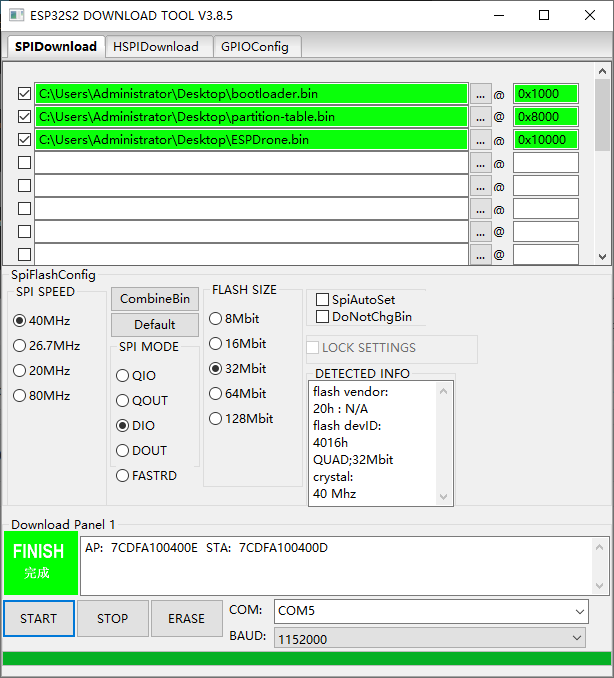
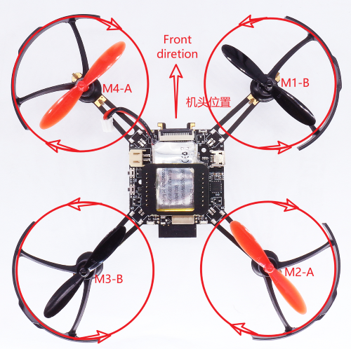

## Flash

使用 esptool 烧写：

```
esptool.py -p (PORT) -b 921600 write_flash --flash_mode dio --flash_size detect --flash_freq 40m 0x10000 bin/ESPlane2S2.bin 0x1000 bin/bootloader.bin 0x8000 bin/partition-table.bin
```

或者使用 Flash 下载工具：

<div align="center">
   
</div>


## App

**Android APP**

Scan the QR code

<div align="center">
   
</div>

**iOS APP**

App Store search  `ESPDrone`

## Password

* SSID：ESPLANE_XXXX
* PASSWORD：12345678

## Test

1. Make sure your propellers in right place(M1:B M2:A M3:B M4:A);
2. Put on the ground;
3. Power on;
4. Make sure your motors direction is right.

